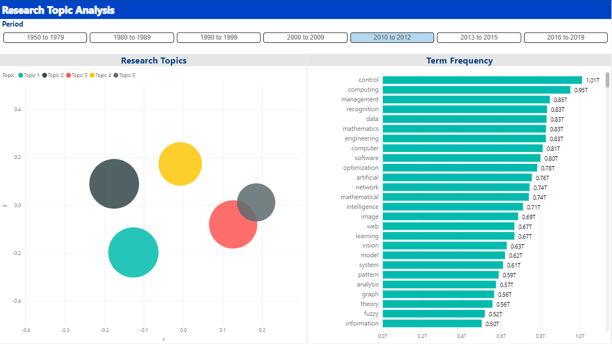
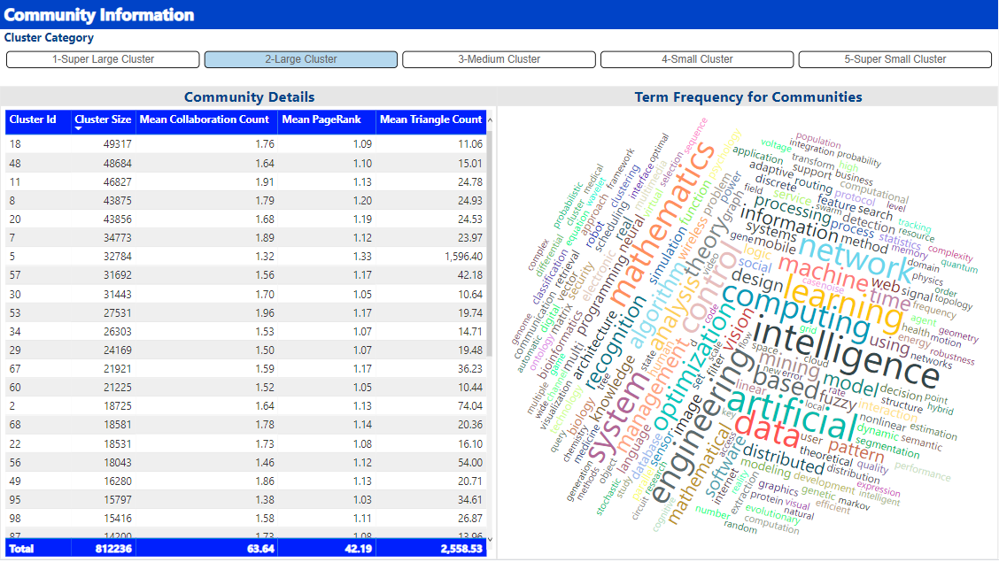
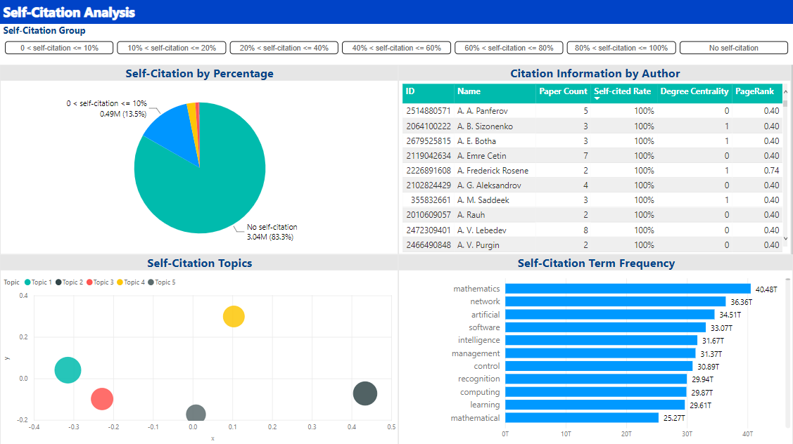
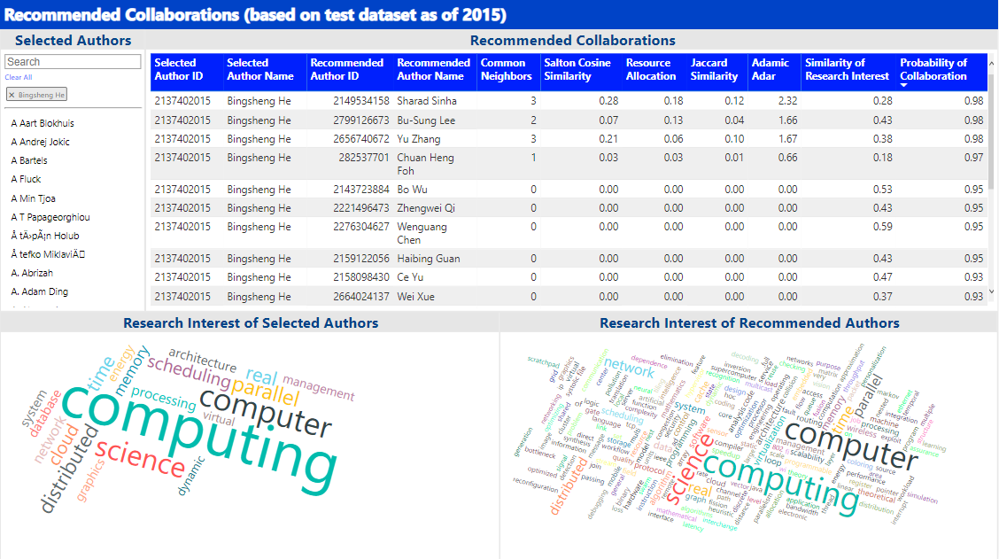
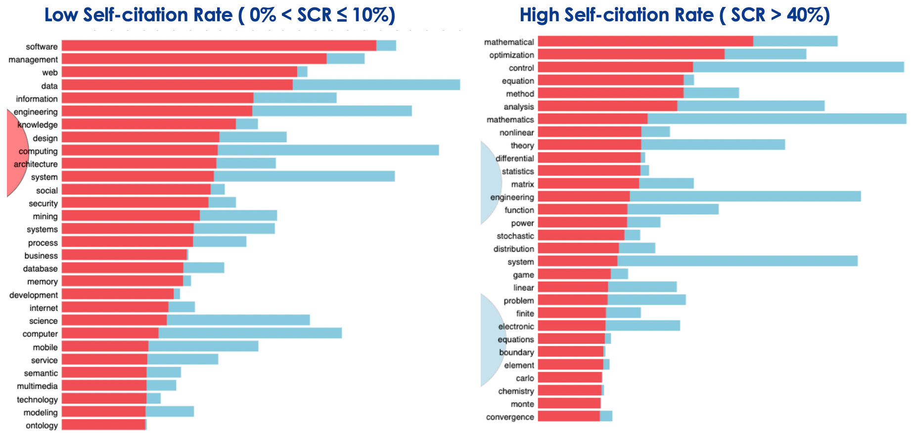

**CS5425 Big Data Systems for Data Science**

**Analysis of Large Scale Academic Social Networks**

This project has provided a comprehensive analysis of the latest academic social networks. The main tasks performed include graph exploratory analysis, research topic analysis, self-citation analysis, community detection and link prediction. 

> For detailed summary & implementation, refer to report [here](Analysis of Large Scale Academic Social Networks.pdf).
>
> Source code is provided in HTML for visual convenience. (Support Azure Databrick Import)

#### Final Visualization in PowerBI

##### 1. Research topic analysis by years (LDA)

##### 2. Community Detection Info

##### 3. Self Citation Analysis based on Topic Detection

##### 4. Recommended Collaborations (Author-level)

##### **5. Low/High Self Citation Rate Analysis (Raw LDA Result on Topic Detection)**

 